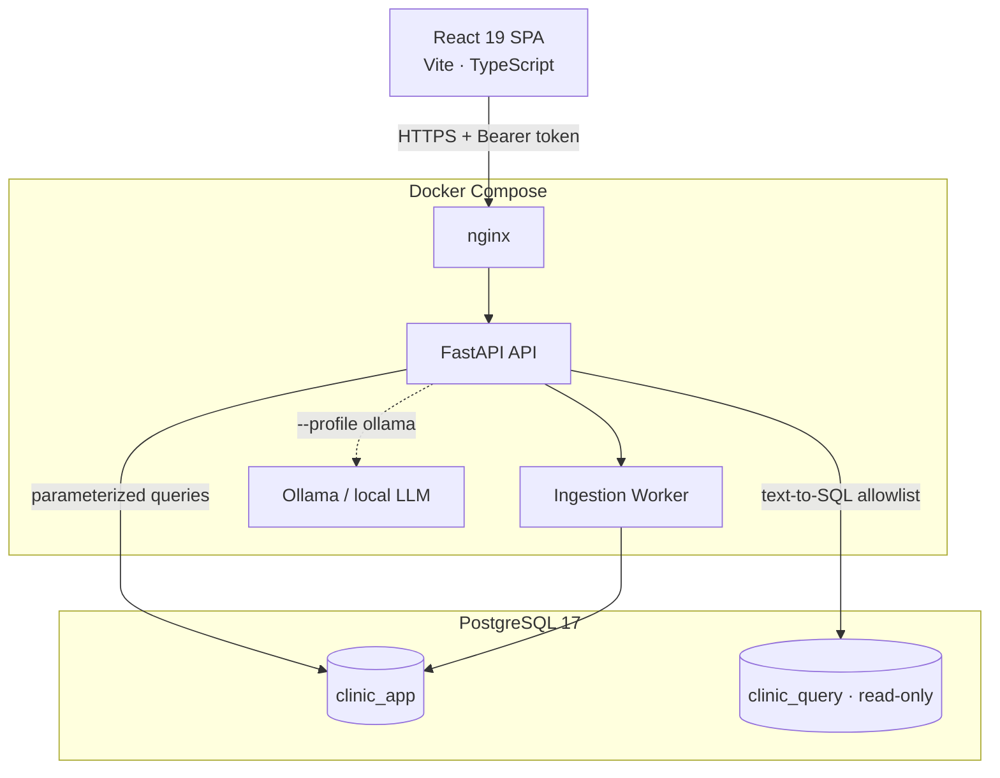

# Clinic Financial Intelligence

> A full-stack financial analytics platform for medical clinics — revenue tracking,
> provider cost analysis, staffing budget simulations, and AI-powered natural-language
> queries over clinic financial data.


---

## Why This Exists

Medical clinics produce financial data across insurance payment statements, provider
costs, staffing, and operations — but most off-the-shelf tools are not built for the
realities of clinic financial management: multi-provider attribution, insurer-level
revenue breakdowns, staffing cost modeling, or asking plain-English questions like
"how did our net margin change this quarter?"

This platform turns raw payment statement exports into structured analytics, supports
budget scenario planning, and lets clinic staff ask natural-language financial questions
that are answered safely — without arbitrary code execution or hallucinated numbers.

---

## Key Features

| Feature | Description |
|---------|-------------|
| **Revenue Explorer** | Weekly/monthly breakdowns by insurer, billing category, and provider. 4/12-week moving averages, margin trends, growth rates. |
| **Budget & Scenario Workspace** | Full staffing cost modeling (salary, benefits, payroll tax), fixed/variable clinic costs, three-scenario break-even projections with monthly editing and side-by-side comparison. |
| **Ask Clarity (Text-to-SQL)** | Natural-language financial questions translated to SQL through a reviewed allowlist. No arbitrary SQL executes. AI cites only values returned from the database — never invents numbers. |
| **Data Imports** | CSV, XLSX, and client-side PDF extraction of insurer payment statements. Content-hash idempotency, row-level validation, durable background worker. |
| **Appointment Analytics** | Aggregate scheduling and activity reporting with CSV import. |
| **37 Architectural Decision Records** | Every major design decision is documented with rationale. |

---

## Architecture


> **To generate this diagram:** export from [Excalidraw](https://excalidraw.com) or draw.io using the description below, save as `docs/screenshots/architecture.png`.

<details>
<summary>View Mermaid source</summary>



</details>

---

## Screenshots

| Overview | Revenue Explorer |
|----------|-----------------|
|  |  |

| Ask Clarity | Budget Workspace |
|-------------|-----------------|
|  |  |

---

## Tech Stack

| Layer | Technology |
|-------|-----------|
| **Frontend** | React 19, TypeScript 5.7, Vite 6, Recharts, Lucide icons |
| **Backend** | Python 3.12, FastAPI, Pydantic, Uvicorn |
| **Database** | PostgreSQL 17, star schema, 10 forward-only migrations |
| **Infrastructure** | Docker Compose (2 files, profiles for Ollama + test DB), nginx, multi-stage builds |
| **Security** | 3 least-privilege DB roles, bearer session auth, read-only containers, `cap_drop: ALL`, `no-new-privileges` |
| **AI (Clarity)** | Text-to-SQL with exact catalog allowlist — 6 reviewed query shapes, grounded citations only. Ollama for local dev. |
| **Testing** | 209 Python tests + 38 React/Vitest tests, GitHub Actions CI |
| **Styling** | Hand-written CSS design system — no framework, responsive, accessible, `prefers-reduced-motion` |

---

## Quick Start

**Requires:** Docker Engine with Compose v2.

```bash
# 1. Clone and configure
git clone https://github.com/your-username/clinic-financial-intelligence.git
cd clinic-financial-intelligence
cp .env.example .env
# Fill in four independent secrets (one per line):
python -c "import secrets; print(secrets.token_hex(32))"

# 2. Start all services
docker compose up --build -d

# 3. Create your login
docker compose run --rm migrate python -m app.bootstrap your-username

# 4. Open the app
open http://localhost:3000
```

### Demo Mode (no real data needed)

The platform includes a built-in demo environment with synthetic financial data.
No external API keys, no real clinic data required.

```bash
# Generate synthetic demo data for your account
docker compose run --rm --user "$(id -u):$(id -g)" \
  -v "$PWD/config:/config" migrate \
  python -m app.ingestion.demo your-username \
  --output /config/ingestion.demo.json --confirm-disposable

cp config/ingestion.demo.json config/ingestion.json
docker compose restart api
```

Then sign in, open **Data Imports**, and upload `examples/synthetic-analytics.csv`.

To enable Ask Clarity with a local LLM, add `--profile ollama` to any compose command.
See **[how-to-run.md](how-to-run.md)** for the full setup guide.

---

## Project Structure

```
app/
  analytics/          # Revenue calculations — pure Decimal, no floating point
  appointments/       # Scheduling aggregates and activity reporting
  ingestion/          # CSV/XLSX/PDF parsers, durable worker, content-hash idempotency
  query/              # Text-to-SQL engine, catalog allowlist, rate limiting, caching
  simulation/         # Staffing and budget modeling, scenario comparison
  main.py             # FastAPI app factory, router registration

frontend/src/
  main.tsx            # App shell, hash routing, auth, lazy loading
  overview.tsx        # Dashboard — KPI metrics, charts, moving averages
  revenue.tsx         # Revenue explorer with filter/drill-down
  clarity.tsx         # Ask Clarity — persistent conversations, structured responses
  budgets.tsx         # Budget workspace — monthly editing, scenario tabs
  appointments.tsx    # Appointment volume reporting
  imports.tsx         # Data import workflow (CSV/XLSX/PDF)
  components.tsx      # Shared UI: Card, Table, Chart, Notice, Metrics
  style.css           # Hand-written design system (sage/forest green palette)

migrations/           # 10 forward-only SQL migrations (001–010)
config/               # Runtime configuration (not committed — see .env.example)
docs/adr/             # 37 architectural decision records
infra/                # PostgreSQL init — 3 least-privilege roles
```

---

## Notable Engineering Decisions

Selected ADRs that demonstrate architectural thinking:

| ADR | Decision |
|-----|----------|
| [ADR 024](docs/adr/024-reviewed-text-to-sql.md) | Text-to-SQL with exact catalog allowlist — no arbitrary SQL executes |
| [ADR 016](docs/adr/016-pure-decimal-analytics.md) | Pure Decimal financial calculations — no floating-point anywhere |
| [ADR 033](docs/adr/033-local-payment-statement-extraction.md) | Client-side PDF extraction — PDF bytes never sent to the server |
| [ADR 013](docs/adr/013-postgres-durable-worker.md) | PostgreSQL-backed durable worker — no Redis or message queue required |
| [ADR 008](docs/adr/008-query-security.md) | Query security — parameterized queries, read-only role, 5-second statement timeout |
| [ADR 006](docs/adr/006-no-phi-scope-trigger.md) | No PHI in scope — financial data only, no patient identifiers |
| [ADR 003](docs/adr/003-forward-only-migrations.md) | Forward-only migrations — no rollback scripts, no ambiguous state |
| [ADR 025](docs/adr/025-query-role-cache-and-usage.md) | Per-clinic rate limiting + token cost tracking in PostgreSQL |

---

## Testing

```bash
# Python unit + integration tests (209 tests)
python -m pip install -r requirements-test.lock
python -m pytest -q

# React / Vitest tests (38 tests)
cd frontend && npm ci && npm test -- --run

# Full CI with live PostgreSQL
docker compose -f compose.yaml -f compose.test.yaml up -d --wait db
# Set TEST_DATABASE_URL and TEST_MIGRATION_DATABASE_URL, then:
python -m pytest -q

# GitHub Actions runs the full suite on every push
# See .github/workflows/test.yml
```

---

## Security Notes

- No default credentials — bootstrap creates your account
- Sessions are revocable bearer tokens stored only in `sessionStorage`
- All containers run read-only with `cap_drop: ALL` and `no-new-privileges`
- The text-to-SQL query role has a 5-second statement timeout and SELECT-only grants
- PDF content is extracted client-side; raw files are never transmitted to the server
- No PHI fields are stored or processed (ADR 006)

---

## Phase 6 (Planned)

TLS termination, encryption at rest, backup/restore, audit log retention and export,
production runbooks. See [progress.md](progress.md) for the full roadmap.

---

## Built By

**Edgar J. Suárez Colón** — [GitHub](https://github.com/your-username)

Questions, feedback, or collaboration: open an issue or reach out on LinkedIn.
